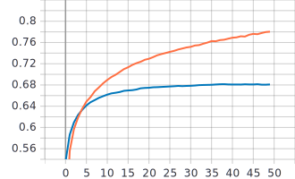
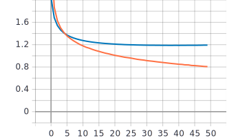
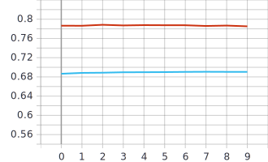
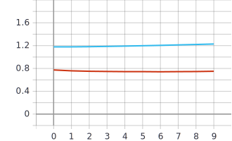

## Лабораторная работа #5.
##        Решение задачи классификации изображений из набора данных Food-101 использованием нейронных сетей глубокого обучения и техники обучения Fine Tuning

## 1. С использованием примера, техники обучения Transfer Learning, оптимальной политики изменения темпа обучения, аугментации данных с оптимальными настройками обучить  нейронную сеть EfficientNet-B0 (предварительно обученную на базе изображений imagenet) для решения задачи классификации изображений Food-101

## Графики

График точности

График функции потерь

## 2. С использованием техники обучения Fine Tuning дополнительно обучить нейронную сеть EfficientNet-B0 предварительно обученную в пункте 1.

## Графики

График точности

График функции потерь

## Анализ результатов:
При использовании техники обучения Fine Tuning с параметром темпа обучения, равным 1е-7, из графиков точности видно, что значения улучшились на 0,95% (augmentation with optimal settings - 68,10%, Fine Tuning - 69,05%)
