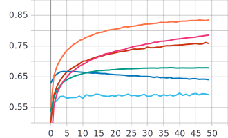
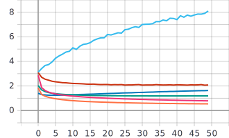
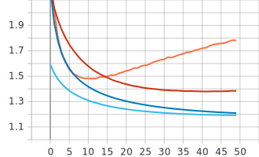
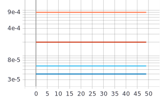
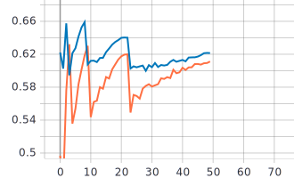
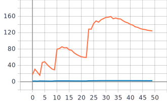
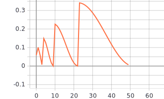
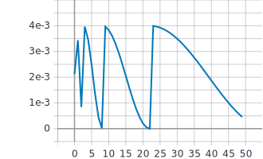

## Лабораторная работа #3.
##          Изучение влияние параметра “темп обучения” на процесс обучения нейронной сети на примере решения задачи классификации Food-101 с использованием техники обучения Transfer Learning
## 1. С использованием и техники обучения Transfer Learning обучить нейронную сеть EfficientNet-B0 (предварительно обученную на базе изображений imagenet) для решения задачи классификации изображений Food-101 с использованием фиксированных темпов обучения 0.01, 0.001, 0.0001.
 

## Графики


График точности



График функции потерь



## 2. Реализовать и применить в обучении следующие политики изменения темпа обучения, а также определить оптимальные параметры для каждой политики:
## a. Косинусное затухание (Cosine Decay) 

```python
tf.keras.experimental.CosineDecay(initial_learning_rate, decay_steps, alpha=0.0)
```
initial_learning_rate	- начальная скорость обучения

decay_steps	- количество шагов

alpha -	минимальное значение скорости обучения

## Графики


График точности


График функции потерь




Графики темпов обучения 




## b. Косинусное затухание с перезапусками (Cosine Decay with Restarts) 
```python
tf.keras.experimental.CosineDecayRestarts(initial_learning_rate, first_decay_steps, t_mul=2.0, m_mul=1.0)
```
initial_learning_rate	- начальная скорость обучения

decay_steps	- количество шагов

t_mul	- используется для определения количества итераций в i-м периоде

m_mul	- используется для получения начальной скорости обучения i-го периода

## Графики


График точности


График функции потерь



Графики темпов обучения 



## Анализ результатов:
1. Исследуя графики метрики точности и графики функции потерь, можно прийти к выводу, что в нашем случае шаг 0,0001 является оптимальным, так как на графике метрики точности наблюдаются наивысшие значения - 67.92%, а на графике функции потерь наименьшие - 1,197.

2а. Исследуя графики метрики точности и графики функции потерь для случая с косинусным затуханием (Cosine Decay),  можно сказать, что в нашем случае (initial_learning_rate=0.002, decay_steps=1000, alpha=0.03) шаг 0,002 является оптимальным, так как на графике метрики точности наблюдаются наивысшие значения - 67.99%, а на графике функции потерь наименьшие - 1,192.

2b. Исследуя графики метрики точности и графики функции потерь для случая с косинусным затуханием с перезапусками (Cosine Decay with Restarts), видим, что наивысшие значения метрики точности cosine decay with restarts достигаются примерно на 8 эпохе с параметрами  first_decay_steps = 1000, t_mul = 2.25, m_mul = 1.5 - 66%. Примерно на той же эпохе достигается наименьшее значение на графике функции потерь - 0,012. 
