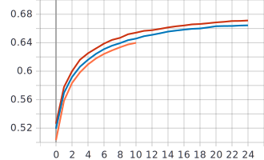
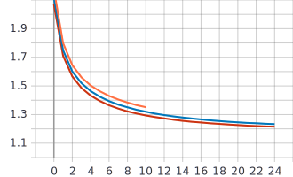

## Лабораторная работа #4.
##         Использование техник аугментации данных для улучшения сходимости процесса обучения нейронной сети на примере решения задачи классификации Food-101


## 1. С использованием, техники обучения Transfer Learning и оптимальной политики изменения темпа обучения, определенной в ходе выполнения лабораторной #3, обучить нейронную сеть EfficientNet-B0 (предварительно обученную на базе изображений imagenet) для решения задачи классификации изображений Food-101 с использованием следующих техник аугментации данных:
## a. Случайное горизонтальное и вертикальное отображение 

```python
tf.keras.layers.experimental.preprocessing.RandomFlip(mode="vertical", seed=None, name=None)
tf.keras.layers.experimental.preprocessing.RandomFlip(mode="horizontal", seed=None, name=None)
tf.keras.layers.experimental.preprocessing.RandomFlip(mode="horizontal_and_vertical", seed=None, name=None)
```

## Графики


График точности


График функции потерь


## b. Использование случайной части изображения 
## Графики


График точности


График функции потерь


## c. Поворот на случайный угол 
 R1, R2, R3 соответственно:
```python
tf.keras.layers.experimental.preprocessing.RandomRotation(0.25, fill_mode='reflect', interpolation='bilinear', seed=None, name=None, fill_value=0.0)
tf.keras.layers.experimental.preprocessing.RandomRotation(0.12, fill_mode='reflect', interpolation='bilinear', seed=None, name=None, fill_value=0.0)
tf.keras.layers.experimental.preprocessing.RandomRotation(0.03, fill_mode='reflect', interpolation='bilinear', seed=None, name=None, fill_value=0.0)
```

## Графики


График точности




График функции потерь




## 2. Реализовать и применить в обучении следующие политики изменения темпа обучения, а также определить оптимальные параметры для каждой политики:
## a. Косинусное затухание (Cosine Decay) 

```python
tf.keras.experimental.CosineDecay(initial_learning_rate, decay_steps, alpha=0.0)
```
initial_learning_rate	- начальная скорость обучения

decay_steps	- количество шагов

alpha -	минимальное значение скорости обучения

## Графики


График точности


График функции потерь


Графики темпов обучения 


## b. Косинусное затухание с перезапусками (Cosine Decay with Restarts) 
```python
tf.keras.experimental.CosineDecayRestarts(initial_learning_rate, first_decay_steps, t_mul=2.0, m_mul=1.0)
```
initial_learning_rate	- начальная скорость обучения

decay_steps	- количество шагов

t_mul	- используется для определения количества итераций в i-м периоде

m_mul	- используется для получения начальной скорости обучения i-го периода

## Графики


График точности

График функции потерь


Графики темпов обучения 

## 2. Для каждой индивидуальной техники аугментации определить оптимальный набор параметров


## 3. Обучить нейронную сеть с использованием оптимальных техник аугментации данных 2a-с совместно

## Анализ результатов:

