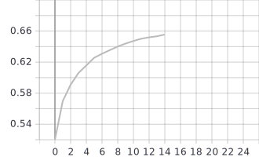
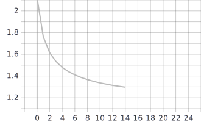

## Лабораторная работа #4.
##         Использование техник аугментации данных для улучшения сходимости процесса обучения нейронной сети на примере решения задачи классификации Food-101


## 1. С использованием, техники обучения Transfer Learning и оптимальной политики изменения темпа обучения, определенной в ходе выполнения лабораторной #3, обучить нейронную сеть EfficientNet-B0 (предварительно обученную на базе изображений imagenet) для решения задачи классификации изображений Food-101 с использованием следующих техник аугментации данных:
## a. Случайное горизонтальное и вертикальное отображение 

```python
tf.keras.layers.experimental.preprocessing.RandomFlip(mode="vertical", seed=None, name=None)
tf.keras.layers.experimental.preprocessing.RandomFlip(mode="horizontal", seed=None, name=None)
tf.keras.layers.experimental.preprocessing.RandomFlip(mode="horizontal_and_vertical", seed=None, name=None)
```

## Графики


График точности


График функции потерь


Изображение, полученное при использовании оптимальных параметров:


## b. Использование случайной части изображения 

## Графики


График точности


График функции потерь


Изображение, полученное при использовании оптимальных параметров:


## c. Поворот на случайный угол 
 R1, R2, R3 соответственно:
```python
tf.keras.layers.experimental.preprocessing.RandomRotation(0.25, fill_mode='reflect', interpolation='bilinear', seed=None, name=None, fill_value=0.0)
tf.keras.layers.experimental.preprocessing.RandomRotation(0.12, fill_mode='reflect', interpolation='bilinear', seed=None, name=None, fill_value=0.0)
tf.keras.layers.experimental.preprocessing.RandomRotation(0.03, fill_mode='reflect', interpolation='bilinear', seed=None, name=None, fill_value=0.0)
```

## Графики


График точности


График функции потерь


Изображение, полученное при использовании оптимальных параметров:


## 2. Для каждой индивидуальной техники аугментации определить оптимальный набор параметров

```python
tf.keras.layers.experimental.preprocessing.RandomFlip(mode="horizontal", seed=None, name=None)
tf.keras.layers.experimental.preprocessing.RandomRotation(0.03, fill_mode='reflect', interpolation='bilinear', seed=None, name=None, fill_value=0.0)
tf.keras.layers.experimental.preprocessing.RandomCrop(CROPSIZE_HEIGHT, CROPSIZE_WIDTH)
```
## 3. Обучить нейронную сеть с использованием оптимальных техник аугментации данных 2a-с совместно
## Графики


График точности




График функции потерь




Изображение, полученное при использовании оптимальных параметров:


## Анализ результатов:

1. Исследовав график точности и график функции потерь, можно прийти к выводу, что параметр 'horizontal' является оптимальным, так как имеет наивысшие значения на графике точности (67.66%).
2. Используя технику аугментации данных RandomCrop, можно сделать вывод, что наиболее оптимальными размерами изображения оказались 274х274, так как на графике точности принимает наивысшие значения: 65.31%. Также методом "проб и ошибок" выяснилось, что если брать значения намного большие или намного меньшие, чем наши, то мы потеряем качество изображения.
3. Используя технику аугментации RandomRotation, выяснилось, что наиболее оптимальными параметрами являются: (0.03, fill_mode='reflect', interpolation='bilinear', seed=None, name=None, fill_value=0.0). Значения на графике точности при этом были 67.12%.
4. При комбинации техник аугментации достигнута точность 65.55%. Сравнивая с RandomFlip, точность уменьшилась на 2,11%, с RandomRotation -  уменьшилась на 1.57%, с RandomCrop - увеличилась на 0,24%.

