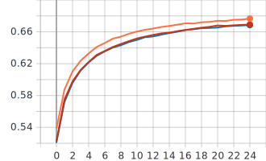
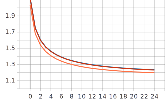
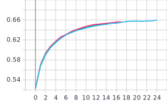
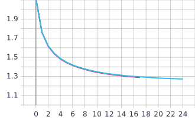

## Лабораторная работа #4.
##         Использование техник аугментации данных для улучшения сходимости процесса обучения нейронной сети на примере решения задачи классификации Food-101


## 1. С использованием, техники обучения Transfer Learning и оптимальной политики изменения темпа обучения, определенной в ходе выполнения лабораторной #3, обучить нейронную сеть EfficientNet-B0 (предварительно обученную на базе изображений imagenet) для решения задачи классификации изображений Food-101 с использованием следующих техник аугментации данных:
## a. Случайное горизонтальное и вертикальное отображение 

```python
tf.keras.layers.experimental.preprocessing.RandomFlip(mode="vertical", seed=None, name=None)
tf.keras.layers.experimental.preprocessing.RandomFlip(mode="horizontal", seed=None, name=None)
tf.keras.layers.experimental.preprocessing.RandomFlip(mode="horizontal_and_vertical", seed=None, name=None)
```

## Графики


График точности




График функции потерь




## b. Использование случайной части изображения 

## Графики


График точности



График функции потерь



## c. Поворот на случайный угол 
 R1, R2, R3 соответственно:
```python
tf.keras.layers.experimental.preprocessing.RandomRotation(0.25, fill_mode='reflect', interpolation='bilinear', seed=None, name=None, fill_value=0.0)
tf.keras.layers.experimental.preprocessing.RandomRotation(0.12, fill_mode='reflect', interpolation='bilinear', seed=None, name=None, fill_value=0.0)
tf.keras.layers.experimental.preprocessing.RandomRotation(0.03, fill_mode='reflect', interpolation='bilinear', seed=None, name=None, fill_value=0.0)
```

## Графики


График точности


График функции потерь


## 2. Для каждой индивидуальной техники аугментации определить оптимальный набор параметров


## 3. Обучить нейронную сеть с использованием оптимальных техник аугментации данных 2a-с совместно

## Анализ результатов:

